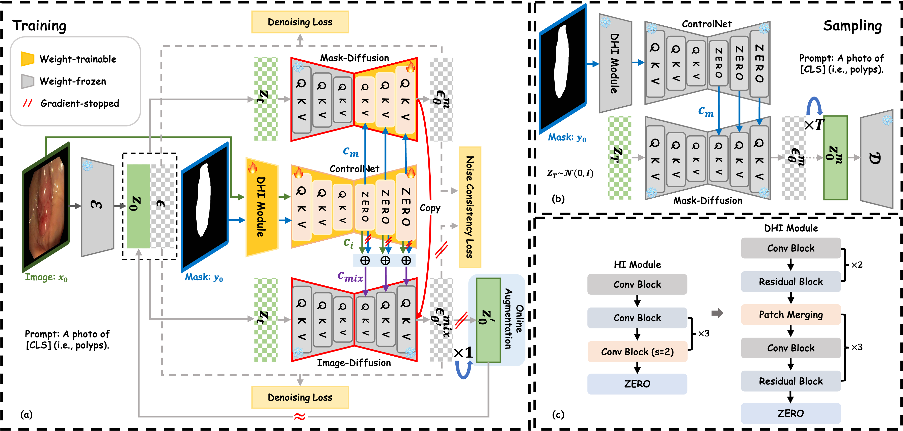

<div align="center">
<h1>Noise-Consistent Siamese-Diffusion for Medical Image Synthesis and Segmentation</h1>

[](https://arxiv.org/abs/2505.06068v1)

</div>

<div align="center">

</div>

### Introduction
Deep learning has revolutionized medical image segmentation, yet its full potential remains constrained by the paucity of annotated datasets. While diffusion models have emerged as a promising approach for generating synthetic image-mask pairs to augment these datasets, they paradoxically suffer from the same data scarcity challenges they aim to mitigate. Traditional mask-only models frequently yield low-fidelity images due to their inability to adequately capture morphological intricacies, which can critically compromise the robustness and reliability of segmentation models. To alleviate this limitation, we introduce Siamese-Diffusion, a novel dual-component model comprising Mask-Diffusion and Image-Diffusion. During training, a Noise Consistency Loss is introduced between these components to enhance the morphological fidelity of Mask-Diffusion in the parameter space. During sampling, only Mask-Diffusion is used, ensuring diversity and scalability. Comprehensive experiments demonstrate the superiority of our method. Siamese-Diffusion boosts SANet’s mDice and mIoU by 3.6\% and 4.4\% on the Polyps, while UNet improves by 1.52\% and 1.64\% on the ISIC2018.


### Requirements
The usual installation steps involve the following commands, they should set up the correct CUDA version and all the python packages:
```bash
conda create -n Siamese-Diffusion python=3.10
conda activate  Siamese-Diffusion
```

### Data and Structure
We evaluated our method on three public datasets: [Polyps](https://github.com/DengPingFan/PraNet) (as provided by the PraNet project), [ISIC2016](https://challenge.isic-archive.com/landing/2016/), and [ISIC2018](https://challenge.isic-archive.com/landing/2018/).
```bash
--data
  --images
  --masks
  --prompt.json
```

### Training
Here are example commands for training:
```bash
# Initialize ControlNet with the pretrained UNet encoder weights from Stable Diffusion,  
# then merge them with Stable Diffusion weights and save as: control_sd15.ckpt  
python tool_add_control.py

# For multi-GPU setups, ZeRO-2 can be used to train Siamese-Diffusion  
# to reduce memory consumption.  
python tutorial_train.py
```

### Sampling
Here are example commands for sampling:
```bash
# ZeRO-2 distributed weights are saved under the folder:  
# lightning_logs/version_#/checkpoints/epoch/  
# Run the following commands to merge the weights:  
python . zero_to_fp32.py  
python tool_merge_control.py

# Sampling  
python tutorial_inference.py
```

### Acknowledgements
This code is developed based on [ControlNet](https://github.com/lllyasviel/ControlNet) and incorporates several segmentation models, including [SANet](https://github.com/weijun-arc/SANet), [Polyp-PVT](https://github.com/DengPingFan/Polyp-PVT), and [CTNet](https://github.com/Fhujinwu/CTNet).

### Citation
If you find our work useful in your research or if you use parts of this code, please consider citing our paper:
```bash
@article{qiu2025noise,
  title={Noise-Consistent Siamese-Diffusion for Medical Image Synthesis and Segmentation},
  author={Qiu, Kunpeng and Gao, Zhiqiang and Zhou, Zhiying and Sun, Mingjie and Guo, Yongxin},
  journal={arXiv preprint arXiv:2505.06068},
  year={2025}
}
```

