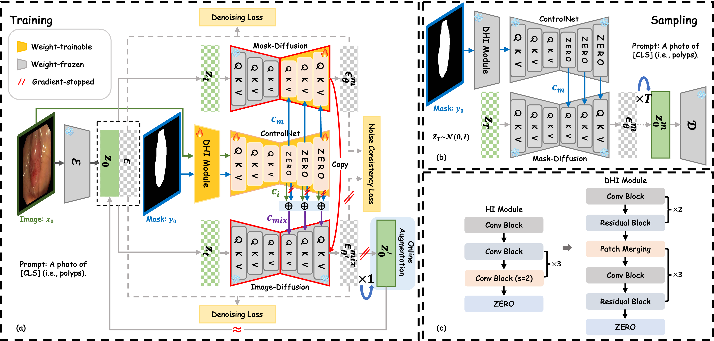

<div align="center">
<h1>Noise-Consistent Siamese-Diffusion for Medical Image Synthesis and Segmentation</h1>

[](https://arxiv.org/abs/2505.06068v1)


</div>

<div align="center">

</div>

### 🚀 **Practical Examples**


<details>
<summary>▶ Click to expand more comparison: Polyp Images</summary>

<!-- Polyp Images -->


</details>

<details>
<summary>▶ Click to expand comparison: ISIC2016 Images</summary>

<!-- ISIC2016 Images -->


</details>

<details>
<summary>▶ Click to expand comparison: ISIC2018 Images</summary>

<!-- ISIC2018 Images -->


</details>

### 🛠️ Requirements
The usual installation steps involve the following commands, they should set up the correct CUDA version and all the python packages:
```bash
conda create -n Siamese-Diffusion python=3.10
conda activate  Siamese-Diffusion
conda install pytorch==2.4.0 torchvision==0.19.0  pytorch-cuda=11.8 -c pytorch -c nvidia
pip install -U xformers --index-url https://download.pytorch.org/whl/cu118
pip install deepspeed
```

### 🗂️ Data and Structure
We evaluated our method on three public datasets: [Polyps](https://github.com/DengPingFan/PraNet) (as provided by the PraNet project), [ISIC2016](https://challenge.isic-archive.com/landing/2016/), and [ISIC2018](https://challenge.isic-archive.com/landing/2018/).
```bash
--data
  --images
  --masks
  --prompt.json
```

### 🏋️‍♂️ Training
  
💡 **Note:** All improvements have been integrated into `cldm.py`, and the `DHI` module is implemented in `dhi.py`. Both are located within the `cldm` folder.

🔥 **Recommendation**

The **DHI** module is a plug-and-play enhancement recommended for all **ControlNet-based** setups.

It significantly accelerates convergence for datasets with large **domain gaps** from pretrained data, such as:

- **Medical segmentation images**  
- **Anomaly detection images**
- ... 

Especially effective when jointly fine-tuning the Stable Diffusion UNet decoder.

Here are example commands for training:
```bash
# Initialize ControlNet with the pretrained UNet encoder weights from Stable Diffusion,  
# then merge them with Stable Diffusion weights and save as: control_sd15.ckpt  
python tool_add_control.py

# For multi-GPU setups, ZeRO-2 can be used to train Siamese-Diffusion  
# to reduce memory consumption.  
python tutorial_train.py
```

### 🎨 Sampling
Here are example commands for sampling:
```bash
# ZeRO-2 distributed weights are saved under the folder:  
# lightning_logs/version_#/checkpoints/epoch/  
# Run the following commands to merge the weights:  
python . zero_to_fp32.py  
python tool_merge_control.py

# Sampling
python tutorial_inference.py
```

### 🖼️ Visualization Results of Ablation Study


<details>
<summary>▶ Click to expand more ablation results: Polyp Images</summary>

<!-- Polyp Images -->


</details>

### 📣 Acknowledgements
This code is developed based on [ControlNet](https://github.com/lllyasviel/ControlNet) and incorporates several segmentation models, including [SANet](https://github.com/weijun-arc/SANet), [Polyp-PVT](https://github.com/DengPingFan/Polyp-PVT), and [CTNet](https://github.com/Fhujinwu/CTNet).

### ⭐️ Star History

<div align="center">
  <a href="https://www.star-history.com/#Qiukunpeng/Siamese-Diffusion&Timeline">
    
  </a>
  <p>⭐️ Thank you to everyone who starred this project — your support means a lot!</p>
</div>

### 📖 Citation
If you find our work useful in your research or if you use parts of this code, please consider citing our paper:
```bash
@article{qiu2025noise,
  title={Noise-Consistent Siamese-Diffusion for Medical Image Synthesis and Segmentation},
  author={Qiu, Kunpeng and Gao, Zhiqiang and Zhou, Zhiying and Sun, Mingjie and Guo, Yongxin},
  journal={arXiv preprint arXiv:2505.06068},
  year={2025}
}
```

